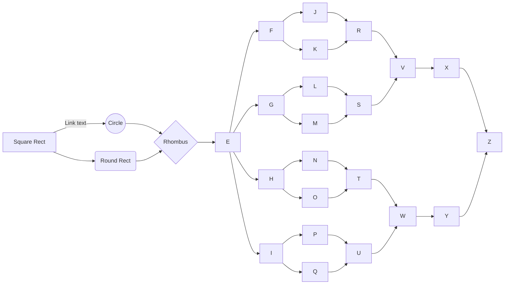
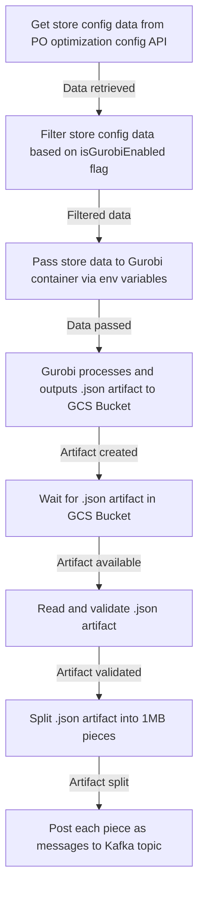

# mermaid-test

```mermaid
graph LR
    A[Square Rect] -- Link text --> B((Circle))
    A --> C(Round Rect)
    B --> D{Rhombus}
    C --> D
    D --> E
    E --> F
    E --> G
    E --> H
    E --> I
    F --> J
    F --> K
    G --> L
    G --> M
    H --> N
    H --> O
    I --> P
    I --> Q
    J --> R
    K --> R
    L --> S
    M --> S
    N --> T
    O --> T
    P --> U
    Q --> U
    R --> V
    S --> V
    T --> W
    U --> W
    V --> X
    W --> Y
    X --> Z
    Y --> Z
```

```mermaid
graph TD
    A[Get store config data from PO optimization config API] -->|Data retrieved| B
    B[Filter store config data based on isGurobiEnabled flag] -->|Filtered data| C
    C[Pass store data to Gurobi container via env variables] -->|Data passed| D
    D[Gurobi processes and outputs .json artifact to GCS Bucket] -->|Artifact created| E
    E[Wait for .json artifact in GCS Bucket] -->|Artifact available| F
    F[Read and validate .json artifact] -->|Artifact validated| G
    G[Split .json artifact into 1MB pieces] -->|Artifact split| H
    H[Post each piece as messages to Kafka topic]

```
