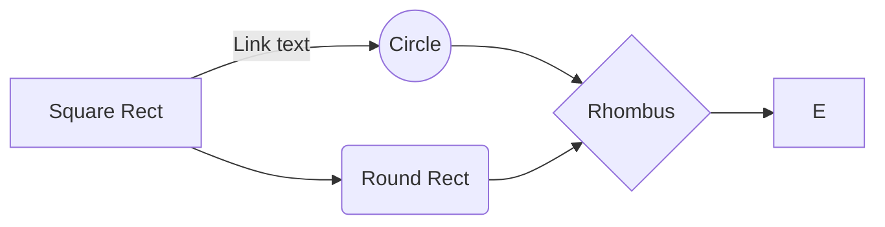
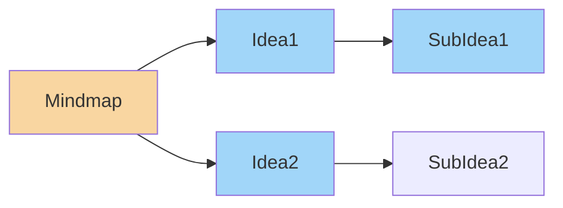
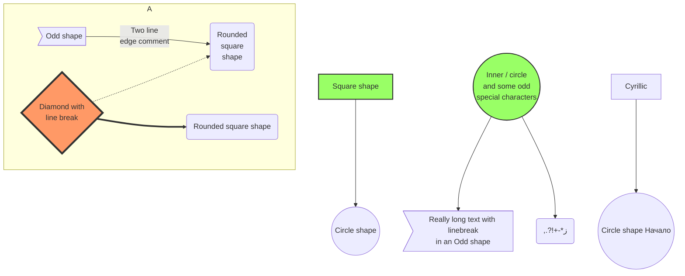

# mermaid-test



```mermaid
classDiagram
 
    BookStore <|-- Book
 
    BookStore <|-- Author
 
    BookStore : +String location
 
    BookStore : +int totalBooks
 
    BookStore: +findBook()
 
    BookStore: +getAuthor()
 
    class Book{
 
        +String title
 
        +int publicationYear
 
        +read()
 
    }
 
    class Author{
 
        -String name
 
        -write()
```




