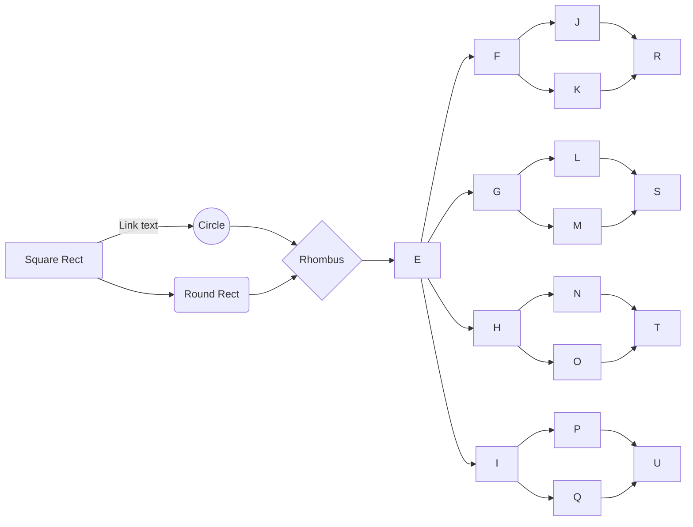

# mermaid-test

```mermaid
graph LR
    A[Square Rect] -- Link text --> B((Circle))
    A --> C(Round Rect)
    B --> D{Rhombus}
    C --> D
    D --> E
    E --> F
    E --> G
    E --> H
    E --> I
    F --> J
    F --> K
    G --> L
    G --> M
    H --> N
    H --> O
    I --> P
    I --> Q
    J --> R
    K --> R
    L --> S
    M --> S
    N --> T
    O --> T
    P --> U
    Q --> U
```
