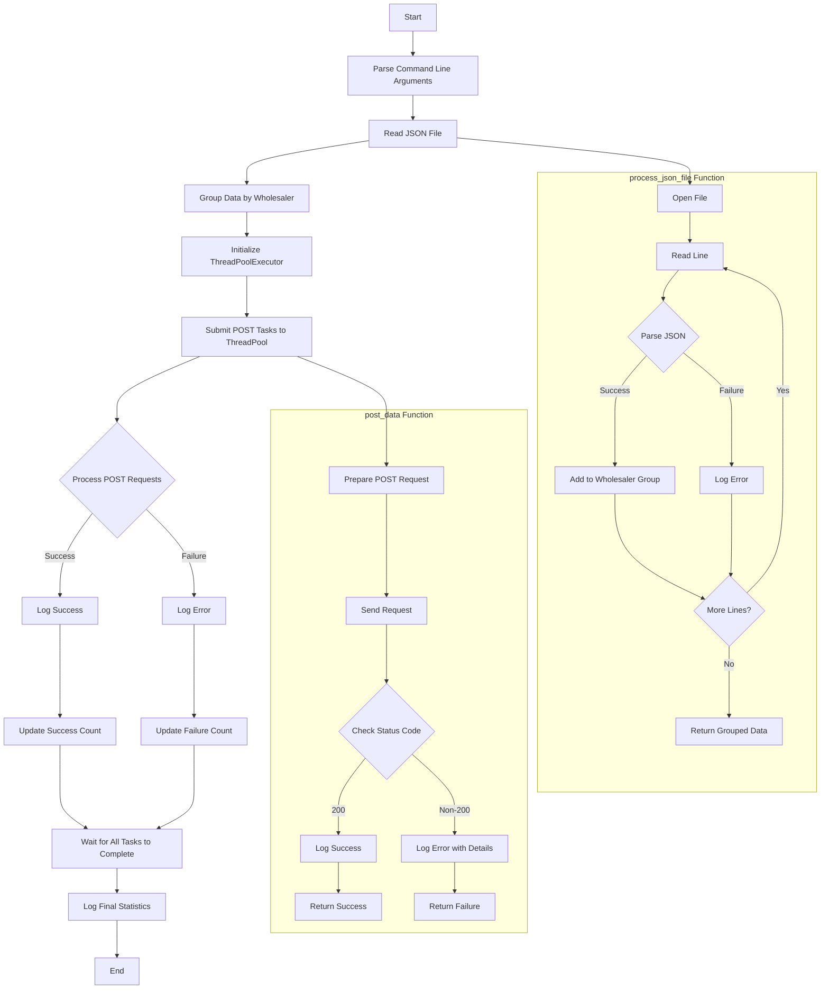

```mermaid
graph TD
    A[Start] --> B[Parse Command Line Arguments]
    B --> C[Read JSON File]
    C --> D[Group Data by Wholesaler]
    D --> E[Initialize ThreadPoolExecutor]
    E --> F[Submit POST Tasks to ThreadPool]
    F --> G{Process POST Requests}
    G -->|Success| H[Log Success]
    G -->|Failure| I[Log Error]
    H --> J[Update Success Count]
    I --> K[Update Failure Count]
    J --> L[Wait for All Tasks to Complete]
    K --> L
    L --> M[Log Final Statistics]
    M --> N[End]

    subgraph "process_json_file Function"
    C1[Open File] --> C2[Read Line]
    C2 --> C3{Parse JSON}
    C3 -->|Success| C4[Add to Wholesaler Group]
    C3 -->|Failure| C5[Log Error]
    C4 --> C6{More Lines?}
    C5 --> C6
    C6 -->|Yes| C2
    C6 -->|No| C7[Return Grouped Data]
    end

    subgraph "post_data Function"
    F1[Prepare POST Request] --> F2[Send Request]
    F2 --> F3{Check Status Code}
    F3 -->|200| F4[Log Success]
    F3 -->|Non-200| F5[Log Error with Details]
    F4 --> F6[Return Success]
    F5 --> F7[Return Failure]
    end

    C --> C1
    F --> F1
```
